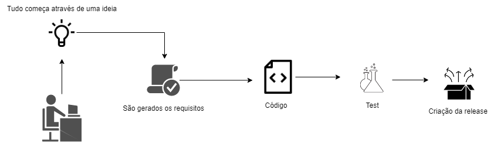
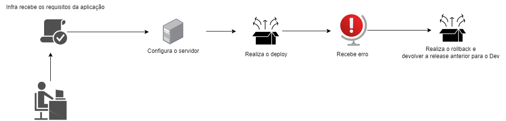

# Conceitos de CI/CD

A ideia de uma pipeline de CI/CD é fornecer um fluxo contínuo de alteração de código, cobrindo todas as etapas manuais que são precisas para levar o código até produção. Com esse método, você se esforça para ter menos intervenção humana ou mesmo nenhuma intervenção, desde o desenvolvimento do novo código até sua implantação.

## Implantação manual 

Quando atuei como um profissional de Middleware, uma das tarefas do dia-a-dia era realizar implantação de software, essa implantação era feita de forma manual no servidor de aplicação.
O desenvolvedor gerava uma release na máquina local e me fornecia essa release através de um sistema de compartilhamento.

Fluxo do desenvolvedor:

 

Fluxo da infra:

 

### Problemas enfrentados

- Fluxo demorado
- Manual
- Factível a erros 

### Integração contínua 

Imagine que estamos trabalhando em um repositório Git em uma squad com 3 devs, diariamente é realizado commits e merge requests, esse repositório está ligado a uma determinada ferramenta que faz a etapa de CI (Build e Teste). A cada nova alteração automaticamente seu código é construido e testado assim evitando possíveis erros.

### Entrega contínua 

Uma vez que temos a etapa de CI automatizada, está na hora de avançarmos mais um passo. Com isso é construido uma segunda etapa que é a de entrega contínua, que tem como objetivo implantar nosso aplicativo em um determinado ambiente, porém ainda sim é preciso uma intervenção manual como acionar algum "gatilho" para ser implantado.

### Implantação contínua

Ao ganhar maturidade na combinação de integração contínua e entrega contínua podemos avançar para implantação contínua. Essa etapa tem como ideia implantar nosso aplicativo nos ambientes de maneira contínua e sem intervenções manuais.

### Um diagrama a seguir das ideias apresentadas

