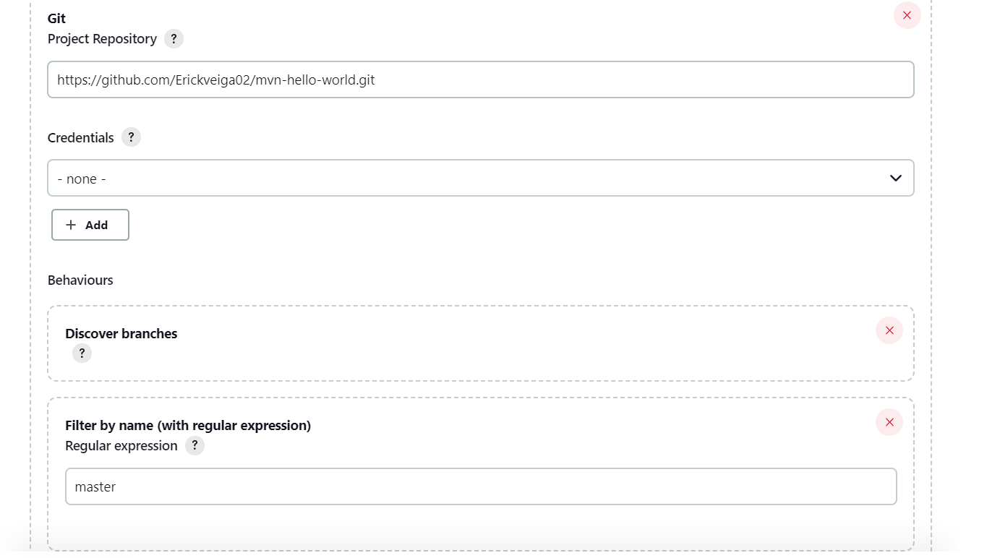

# Integração contínua 

Como já mencionamos anteriormente integração contínua é o processo em que os desenvolvedores realizam commits com frequência em um determinado repositório. Depois disso é realizado Build e Tests de maneira automatizada.

### Quais objetivos queremos atingir com  CI?

A ideia do CI é encontrar bugs, melhorar a qualidade e reduzir o tempo de lançamento do sofware.

### Criação do Job no Jenkins

1. O Job que vai ser criado é multibranch:


2. Configurar o Job:


Observações:
- Job multibranch procura por branchs que tenham um Jenkinsfile
- Necessário especificar qual branch deseja trabalhar, como apresentado na segunda imagem a branch que buscamos é a "master"

### Jenkinsfile 

O jenkinsfile é o arquivo para declarar os estágios da pipeline

```
pipeline { 
     agent {
    kubernetes {
      label 'spring-petclinic-demo'
      defaultContainer 'jnlp'
      yaml '''
kind: Pod
metadata:
  name: ci
labels:
  component: mvn
spec:
  containers:
  - name: mvn
    image: maven:3-jdk-8-alpine
    command:
    - sleep
    args:
    - 9999999

'''
    }
  }
 
    stages { 
        stage('Build') { 
            steps { 
            container('mvn'){
               sh 'mvn package'
            }
            }
        }
        stage('Unit test'){
            steps{
                container('mvn'){
                    sh 'mvn test'
                }
            }
        }
    }
}
```

### Configuração de Agent

O Jenkins está hospedado no K8s logo seus agentes podem ser POD para facilitar a execução de Jobs especificos.

```
     agent {
    kubernetes {
      label 'spring-petclinic-demo'
      defaultContainer 'jnlp'
      yaml '''
kind: Pod
metadata:
  name: ci
labels:
  component: mvn
spec:
  containers:
  - name: mvn
    image: maven:3-jdk-8-alpine
    command:
    - sleep
    args:
    - 9999999

'''
    }
  }
```
Esse é um POD template por ele é definido qual imagem vai ser utilizada, também é possível dizer qual namespace vai ser utilizado para hospedar esse agent. Ele só é executado durante o uso da pipeline.

### Build 

```
        stage('Build') { 
            steps { 
            container('mvn'){
               sh 'mvn package'
                }
            }
        }
```

### Teste

```
        stage('Unit test'){
            steps{
                container('mvn'){
                    sh 'mvn test'
                }
            }
        }
```
